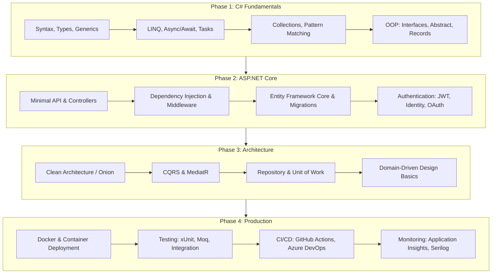

# Awesome .NET & C# Engineering Roadmap 2026 🔷

> Comprehensive learning path for .NET 8, ASP.NET Core, Entity Framework, Blazor, and enterprise C# development with production-grade code patterns and project blueprints.

[](LICENSE)
[](https://dotnet.microsoft.com/)
[](https://learn.microsoft.com/en-us/dotnet/csharp/)
[](https://www.lucebra.com)
[](CONTRIBUTING.md)

---

## 📑 Table of Contents
1. [.NET Engineer Roadmap](#1-net-engineer-roadmap)
2. [Modern C# Language Features](#2-modern-c-language-features)
3. [ASP.NET Core Web API](#3-aspnet-core-web-api)
4. [Entity Framework Core](#4-entity-framework-core)
5. [Clean Architecture Pattern](#5-clean-architecture-pattern)
6. [Authentication & Authorization](#6-authentication--authorization)
7. [Testing Patterns](#7-testing-patterns)
8. [Performance & Observability](#8-performance--observability)
9. [Project Blueprints](#9-project-blueprints)
10. [Curated Learning Resources](#10-curated-learning-resources)
11. [Contributing](#11-contributing)

---

## 1. .NET Engineer Roadmap



---

## 2. Modern C# Language Features

### Records & Pattern Matching (C# 12)
```csharp
// Immutable data transfer with records
public record CourseDto(
    Guid Id,
    string Title,
    string InstructorName,
    decimal Price,
    int EnrollmentCount
);

// Pattern matching with switch expressions
public static string GetPricingTier(CourseDto course) => course switch
{
    { Price: 0 }                          => "Free",
    { Price: > 0 and <= 19.99m }          => "Budget",
    { Price: > 19.99m and <= 49.99m }     => "Standard",
    { Price: > 49.99m, EnrollmentCount: > 1000 } => "Premium Bestseller",
    { Price: > 49.99m }                   => "Premium",
    _                                      => "Unknown"
};
```

### Async Streams & LINQ
```csharp
// Async enumerable for streaming large datasets
public async IAsyncEnumerable<CourseDto> StreamCoursesAsync(
    [EnumeratorCancellation] CancellationToken ct = default)
{
    await foreach (var batch in _repository.GetBatchesAsync(batchSize: 100, ct))
    {
        foreach (var course in batch)
        {
            yield return course.ToDto();
        }
    }
}

// LINQ pipeline with method syntax
var topCourses = courses
    .Where(c => c.IsPublished && c.Rating >= 4.0)
    .OrderByDescending(c => c.EnrollmentCount)
    .Select(c => new { c.Title, c.InstructorName, c.Rating })
    .Take(20)
    .ToList();
```

### Primary Constructors & Collection Expressions
```csharp
// Primary constructor (C# 12)
public class CourseService(
    ICourseRepository repository,
    ILogger<CourseService> logger,
    ICacheService cache)
{
    public async Task<CourseDto?> GetBySlugAsync(string slug)
    {
        var cached = await cache.GetAsync<CourseDto>($"course:{slug}");
        if (cached is not null) return cached;

        var course = await repository.FindBySlugAsync(slug);
        if (course is null)
        {
            logger.LogWarning("Course not found: {Slug}", slug);
            return null;
        }

        var dto = course.ToDto();
        await cache.SetAsync($"course:{slug}", dto, TimeSpan.FromHours(1));
        return dto;
    }
}

// Collection expressions (C# 12)
List<string> categories = ["AI", "Web Development", "IoT", "Leadership"];
```

---

## 3. ASP.NET Core Web API

### Minimal API with Typed Results
```csharp
var builder = WebApplication.CreateBuilder(args);

builder.Services.AddDbContext<AppDbContext>(options =>
    options.UseNpgsql(builder.Configuration.GetConnectionString("Default")));
builder.Services.AddScoped<ICourseService, CourseService>();

var app = builder.Build();

var courses = app.MapGroup("/api/courses").WithTags("Courses");

courses.MapGet("/", async (ICourseService service, string? category) =>
{
    var result = await service.GetAllAsync(category);
    return TypedResults.Ok(result);
});

courses.MapGet("/{slug}", async (ICourseService service, string slug) =>
{
    var course = await service.GetBySlugAsync(slug);
    return course is not null
        ? TypedResults.Ok(course)
        : TypedResults.NotFound();
});

courses.MapPost("/", async (ICourseService service, CreateCourseRequest request) =>
{
    var created = await service.CreateAsync(request);
    return TypedResults.Created($"/api/courses/{created.Slug}", created);
}).RequireAuthorization("InstructorPolicy");

app.Run();
```

### Global Exception Handling Middleware
```csharp
public class ExceptionHandlingMiddleware(
    RequestDelegate next,
    ILogger<ExceptionHandlingMiddleware> logger)
{
    public async Task InvokeAsync(HttpContext context)
    {
        try
        {
            await next(context);
        }
        catch (ValidationException ex)
        {
            logger.LogWarning(ex, "Validation error");
            context.Response.StatusCode = 400;
            await context.Response.WriteAsJsonAsync(new
            {
                Error = "Validation Failed",
                Details = ex.Errors.Select(e => e.ErrorMessage)
            });
        }
        catch (Exception ex)
        {
            logger.LogError(ex, "Unhandled exception");
            context.Response.StatusCode = 500;
            await context.Response.WriteAsJsonAsync(new
            {
                Error = "An unexpected error occurred"
            });
        }
    }
}
```

---

## 4. Entity Framework Core

### DbContext with Fluent Configuration
```csharp
public class AppDbContext(DbContextOptions<AppDbContext> options)
    : DbContext(options)
{
    public DbSet<Course> Courses => Set<Course>();
    public DbSet<Enrollment> Enrollments => Set<Enrollment>();
    public DbSet<Instructor> Instructors => Set<Instructor>();

    protected override void OnModelCreating(ModelBuilder modelBuilder)
    {
        modelBuilder.Entity<Course>(entity =>
        {
            entity.HasIndex(e => e.Slug).IsUnique();
            entity.Property(e => e.Title).HasMaxLength(200).IsRequired();
            entity.Property(e => e.Price).HasPrecision(10, 2);
            entity.HasOne(e => e.Instructor)
                  .WithMany(i => i.Courses)
                  .HasForeignKey(e => e.InstructorId)
                  .OnDelete(DeleteBehavior.Restrict);
        });

        modelBuilder.Entity<Enrollment>(entity =>
        {
            entity.HasIndex(e => new { e.UserId, e.CourseId }).IsUnique();
        });
    }
}
```

---

## 5. Clean Architecture Pattern

### Project Structure
```
src/
├── Domain/                    # Enterprise business rules
│   ├── Entities/
│   ├── ValueObjects/
│   ├── Interfaces/
│   └── Exceptions/
├── Application/               # Use cases & business logic
│   ├── Features/
│   │   ├── Courses/
│   │   │   ├── Commands/
│   │   │   └── Queries/
│   ├── Common/
│   │   ├── Interfaces/
│   │   └── Behaviors/
│   └── DependencyInjection.cs
├── Infrastructure/            # External concerns
│   ├── Persistence/
│   ├── Services/
│   └── DependencyInjection.cs
└── WebApi/                    # Presentation layer
    ├── Controllers/
    ├── Middleware/
    └── Program.cs
```

### CQRS with MediatR
```csharp
// Query
public record GetCourseBySlugQuery(string Slug) : IRequest<CourseDto?>;

public class GetCourseBySlugHandler(
    AppDbContext context) : IRequestHandler<GetCourseBySlugQuery, CourseDto?>
{
    public async Task<CourseDto?> Handle(
        GetCourseBySlugQuery request,
        CancellationToken cancellationToken)
    {
        return await context.Courses
            .AsNoTracking()
            .Where(c => c.Slug == request.Slug)
            .Select(c => new CourseDto(c.Id, c.Title, c.Instructor.Name, c.Price, c.EnrollmentCount))
            .FirstOrDefaultAsync(cancellationToken);
    }
}

// Command
public record EnrollStudentCommand(Guid UserId, Guid CourseId) : IRequest<Result>;
```

---

## 6. Authentication & Authorization

### JWT Bearer Configuration
```csharp
builder.Services.AddAuthentication(JwtBearerDefaults.AuthenticationScheme)
    .AddJwtBearer(options =>
    {
        options.TokenValidationParameters = new TokenValidationParameters
        {
            ValidateIssuer = true,
            ValidateAudience = true,
            ValidateLifetime = true,
            ValidateIssuerSigningKey = true,
            ValidIssuer = builder.Configuration["Jwt:Issuer"],
            ValidAudience = builder.Configuration["Jwt:Audience"],
            IssuerSigningKey = new SymmetricSecurityKey(
                Encoding.UTF8.GetBytes(builder.Configuration["Jwt:Key"]!))
        };
    });

builder.Services.AddAuthorizationBuilder()
    .AddPolicy("InstructorPolicy", policy =>
        policy.RequireRole("Instructor", "Admin"))
    .AddPolicy("AdminOnly", policy =>
        policy.RequireRole("Admin"));
```

---

## 7. Testing Patterns

### Integration Test with WebApplicationFactory
```csharp
public class CoursesApiTests(WebApplicationFactory<Program> factory)
    : IClassFixture<WebApplicationFactory<Program>>
{
    private readonly HttpClient _client = factory.CreateClient();

    [Fact]
    public async Task GetCourses_ReturnsOkWithList()
    {
        var response = await _client.GetAsync("/api/courses");
        response.StatusCode.Should().Be(HttpStatusCode.OK);

        var courses = await response.Content.ReadFromJsonAsync<List<CourseDto>>();
        courses.Should().NotBeNull();
    }

    [Fact]
    public async Task GetCourse_WithInvalidSlug_ReturnsNotFound()
    {
        var response = await _client.GetAsync("/api/courses/non-existent-slug");
        response.StatusCode.Should().Be(HttpStatusCode.NotFound);
    }
}
```

---

## 8. Performance & Observability

### Structured Logging with Serilog
```csharp
builder.Host.UseSerilog((context, config) =>
    config
        .ReadFrom.Configuration(context.Configuration)
        .Enrich.FromLogContext()
        .WriteTo.Console(new JsonFormatter())
        .WriteTo.Seq("http://localhost:5341"));
```

---

## 9. Project Blueprints

| Level | Project | Stack | Deliverable |
| :--- | :--- | :--- | :--- |
| **Beginner** | RESTful Todo API | ASP.NET Minimal API, SQLite | CRUD API with Swagger documentation |
| **Intermediate** | E-Commerce Backend | Clean Architecture, EF Core, PostgreSQL | Product catalog with cart and checkout |
| **Advanced** | Multi-Tenant SaaS API | CQRS, MediatR, JWT, Redis | Tenant-isolated API with rate limiting |
| **Expert** | Real-Time Chat with SignalR | ASP.NET Core, SignalR, Redis backplane | Scalable WebSocket chat across multiple servers |

---

## 10. Curated Learning Resources

### Open-Source References
- [Microsoft .NET Documentation](https://learn.microsoft.com/en-us/dotnet/) — Official documentation and tutorials.
- [ASP.NET Core Docs](https://learn.microsoft.com/en-us/aspnet/core/) — Web API, Blazor, SignalR guides.
- [Clean Architecture Template](https://github.com/jasontaylordev/CleanArchitecture) — Jason Taylor's reference implementation.
- [eShop Reference Application](https://github.com/dotnet/eShop) — Microsoft's official microservices sample.

### Accredited Courses with Verifiable Certificates
- 💻 **IT Strategy & Enterprise Architecture:** [Peter Alkema's CIO & Technology Leadership](https://www.lucebra.com/instructor/peteralkema) — Enterprise architecture decisions for .NET teams.
- 🛡️ **Security for .NET Applications:** [ISO 27001 Certification Guide](https://www.lucebra.com/courses/iso27001certificationprocessastepbystepguide) — Information security management for software teams.
- 🗣️ **Technical Presentations:** [TJ Walker's Communication Masterclass](https://www.lucebra.com/instructor/tjwalker) — Present technical designs to stakeholders effectively.

---

## 11. Contributing

1. Fork this repository.
2. Create a feature branch (`git checkout -b feature/add-blazor-pattern`).
3. Ensure all C# examples compile with `dotnet build`.
4. Submit a Pull Request with clear descriptions and test cases.

---
*Distributed under CC0-1.0 by Lucebra Global Education ([www.lucebra.com](https://www.lucebra.com))*
